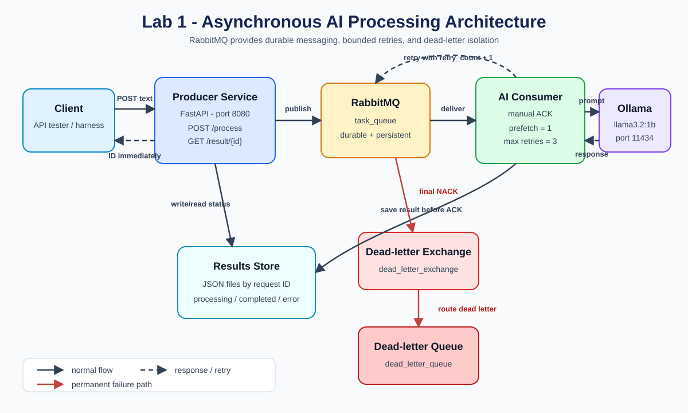

# Architecture Diagram

## Message flow

1. The client sends text to `POST /process` and immediately receives a request ID.
2. The producer stores `processing` and publishes a persistent message to the durable `task_queue`.
3. The consumer calls Ollama and stores the result before acknowledging the message.
4. The client polls `GET /result/{id}` until the status becomes `completed` or `error`.
5. A failed AI request is retried at most three times. A permanent failure is rejected without requeueing, so RabbitMQ routes it through `dead_letter_exchange` to `dead_letter_queue`.
